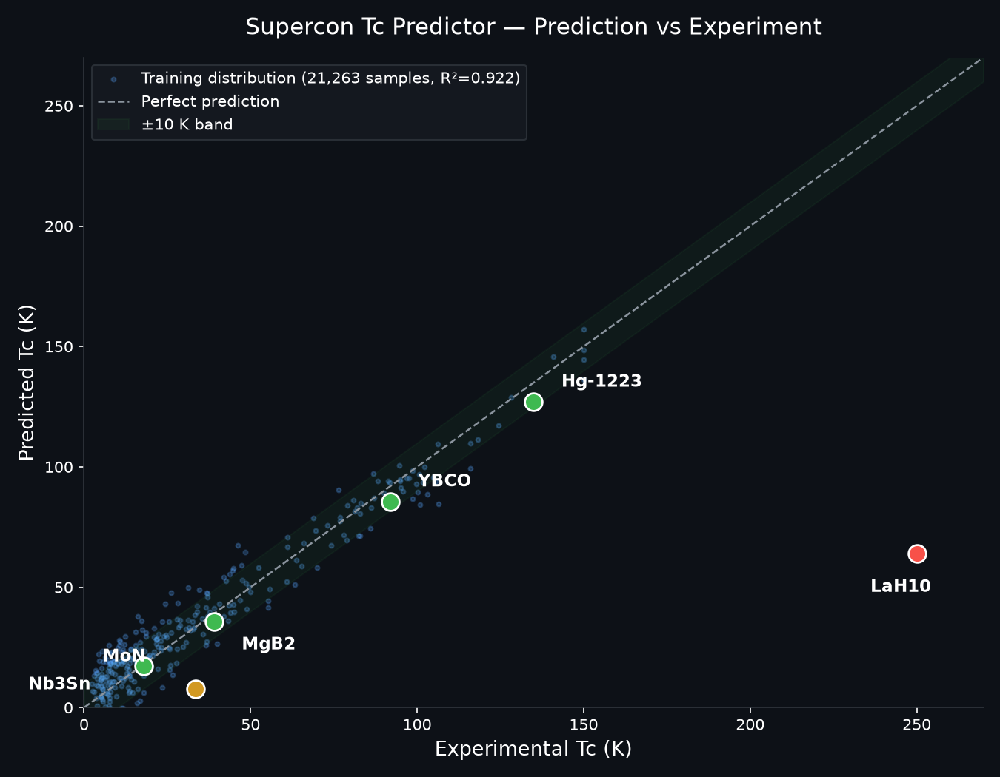

# 超导临界温度预测工具 Supercon Tc Predictor

**输入一个化学式，几秒钟告诉你它大概多少度能变成超导体（临界温度 Tc）。**
基于 **21,263 条真实实验数据**训练 —— 它认识的领域里预测很准，出了它的认识范围，它会老实告诉你"这个我不太敢打包票"。



---

## 这是什么？用大白话说

超导材料研究里有个大难题：**一种新材料能不能超导、多少度超导，往往要花大价钱做实验才知道**。这个工具想做的事是——你给它一个化学式（比如 `YBa2Cu3O7`），它根据过去 2 万多条真实实验记录，快速给出一个参考预测值。

它和普通"AI 算命"最大的区别是**诚实**：预测得准不准、哪些情况它没把握，它会明确标注出来，不糊弄你。

## 它准吗？看真实案例（都是实际跑出来的）

| 材料 | 预测值 | 实验值 | 说明 |
|---|---|---|---|
| Hg-1223（汞系，常压纪录保持者） | 126.9 K | ~135 K | 误差约 6%，很接近 |
| YBCO（钇钡铜氧） | 85.5 K | ~92 K | 差 7 K 以内 |
| MgB₂（二硼化镁） | 35.7 K | 39 K | 差 3.3 K |
| Nb₃Sn（铌三锡，工程磁体主力） | 17.2 K | 18 K | 差不到 1 K，神准 |
| MoN（氮化钼） | 7.7 K | 文献声称 33.4 K | **翻车案例：训练数据里这类太少，它老实认怂** |
| LaH₁₀（氢化物，高压体系） | 64.1 K | ~250 K（高压） | **明确标注"外推区，仅供参考"** |

**最后两行才是这个项目的灵魂**：它对自己认识的领域预测很准，出了认识范围**它知道自己在瞎猜，并且会说出来**——而不是给你一个自信满满的错误答案。

## 核心指标

| 指标 | 数值 |
|---|---|
| 训练数据 | 21,263 条真实实验记录（SuperCon 数据库 + 文献） |
| 算法 | 随机森林（200 棵树） |
| 交叉验证 R² | **0.922** |
| 误差 RMSE | **9.6 K** |
| 特征空间 | 81 维化学描述符（元素组成统计量） |
| 使用方式 | 化学式 → 预测 Tc（开尔文） |

## 快速开始

```bash
pip install numpy pandas scikit-learn joblib matplotlib

# 预测单个化学式
python tc_predictor.py "YBa2Cu3O7"
python tc_predictor.py "HgBa2Ca2Cu3O8" --detail
```

### 输出示例

```
化学式      : HgBa2Ca2Cu3O8
预测临界温度: 126.9 K (摄氏 -146.2°C)
判定        : 🟢 高于液氮温度77K, 高温超导潜力
信任区      : 🔴 red (外推校准)
家族        : cuprate_Hg
模型精度    : R2=0.922 RMSE=9.6 K (5折CV)
⚠️ [B1] 预测>=100K 的输出必须标记 '外推区, 需文献验证'
⚠️ [B8] 高Tc端统计模型可能系统性低估, 预测应视为下界参考
```

## 文件说明

```
├── tc_predictor.py          # 主程序：化学式 → 预测值 + 边界警告
├── boundary_rules.json      # 边界规则（外推/家族/压力 判定规则）
├── train_model.py           # 训练脚本（随机森林，5折交叉验证）
├── supercon_formula_lib.py  # 化学式解析 + 81维特征构建
├── supercon_element_props_data.py  # 元素属性表
├── example.py               # 在线 API 调用示例
├── docs/
│   ├── DATA.md              # 数据说明与预处理
│   └── tc-prediction-practice.md  # 真实使用中的实践笔记
└── predict_vs_experiment.png
```

## 在线体验

**https://tcpredict.top** —— 免费试用，不用绑卡。

- 输入化学式（如 `YBa2Cu3O7`），几秒钟出结果 + 置信参考
- 注册送 10 次免费试用；没用完的次数可退

## 诚实政策（Honesty policy）

- 预测结果仅作科研参考，**不能替代**第一性原理计算和实验验证
- 预测 ≥100 K 的输出一律标注"外推区，需文献验证"
- 高 Tc 外推一律视为**下界参考**（统计模型在高 Tc 区会系统性低估，见 Xie et al., npj Comput. Mater. 2022）
- 模型绝不在 ≥100 K 区域按预测值排序候选材料（已知反相关，B4 规则）

## 联系

- 网站：https://tcpredict.top
- 邮箱：382776397@qq.com

---

## English Summary

**AI-powered prediction of superconducting critical temperature (Tc) from chemical formula.**
Trained on 21,263 real experimental records — highly accurate **inside** the training distribution,
and **honest** about extrapolation (explicit warnings instead of overconfident numbers).

| Metric | Value |
|---|---|
| Algorithm | Random Forest (200 trees) |
| CV R² | **0.922** |
| RMSE | **9.6 K** |
| Features | 81 chemical descriptors |

**Signature cases**: Hg-1223 126.9K vs ~135K · YBCO 85.5 vs 92 · MgB₂ 35.7 vs 39 · Nb₃Sn 17.2 vs 18 ·
MoN 7.7 vs 33.4 (honest miss) · LaH₁₀ 64.1 vs ~250 (flagged extrapolation).

**Live demo (free, no credit card)**: https://tcpredict.top

**Honesty policy**: predictions are research references only; ≥100K outputs are always flagged;
high-Tc extrapolations are lower-bound references (see Xie et al., npj Comput. Mater. 2022).

---

*Made with ❤️ for the superconductivity research community*
